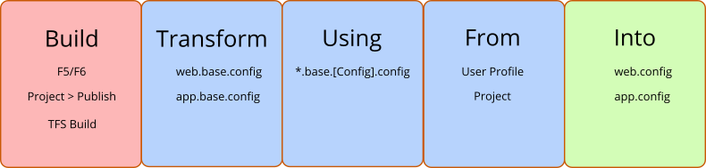
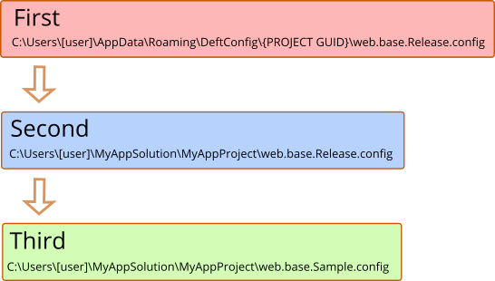

#  DeftConfig





## Goals
DeftConfig achieves several goals. Web.config is used the examples below, but DeftConfig applies equally to app.config.

1. Don't store web.config or web.Debug/Release.config in source control.
2. Don't store web.Debug.config in source control, allow independent developer configurations.
2. Use web.base.config file for XmlTransform source, and apply web.base.[Configuration].config transform file.
3. Make Windows-based Continuous Integration easier and more secure by searching for transform files in a user profile folder first, then in the project file.
4. Make it easier for new developers to use non-destructive settings.

## Cons
All isn't lemonade and corn dogs when using DeftConfig. There are a few challenges that you need to be aware of.

1. NuGet packages often modify the web.config file (EntityFramework, for example). It will be critical for developers who add packages to copy any changes from the local web.config into web.base.config.
2. If you change *only* one of the config files, then do a standard build (F6), web.config won't be updated. You'll need to do a Rebuild. (This is not an issue with TFS Build server, which always does a rebuild).

## Installation
1. Install the NuGet package. This adds the DeftConfig.targets file, and an executable named DeftConfigInitializer is copied to the project root folder.
2. Run DeftConfigInitializer, which will 
    1. Create a user profile folder for config files, if desired.
    2. Convert existing *.config files to use the *.base.config method. 
    3. Add a .gitignore or .tfignore file so that the standard *.config files are ignored by default.
3. Delete DeftConfigInitializer, if desired.

Typical project files before DeftConfig


and after running DeftConfigInitializer


The Debug and Release configs are still in the project folder, except they've been converted to "base" files.


## Files
Any settings that were previously in web.config are now in web.base.config. 

Here are the recommended way of using the files, with an example. The original web.config had these appSettings. Notice that the production and dev credentials are being stored. Developers have been commenting/uncommenting.

```xml
</appSettings>
    <add key="CustomizationVersion" value="HGC1234" />
    <!--
    <add key="WebServiceUser" value="dev-user"/>
    <add key="WebServicePassword" value="DevPass"/>
    -->
    <add key="WebServiceUser" value="production-admin"/>
    <add key="WebServicePassword" value="Pr0ductionPassw0rd!"/>
</appSettings>
```

### web.base.config

The base config should retain values that are *not* transformed, and shouldn't have values for settings that will be tranformed. This is also a good place to document the settings. Copy those credential appSettings elsewhere, we'll need them later.

```xml
</appSettings>
    <!-- Don't change: It's specific to this client -->
    <add key="CustomizationVersion" value="HGC1234" />
    <!-- Credentials for the 3rd party web service -->
    <add key="WebServiceUser" value=""/>
    <add key="WebServicePassword" value="" />
</appSettings>
```

### web.base.Sample.config

The Sample config file *is* stored in source control. It acts as a default configuration. If a Configuration (Debug/Release) config file can't be found, the Sample will be used. These could be default values for a developer, or dummy values. 

```xml
</appSettings>
    <add key="WebServiceUser" value="user" xdt:Locater="Match(key)" xdt:Transform="Replace"/>
    <add key="WebServicePassword" value="pass" xdt:Locater="Match(key)" xdt:Transform="Replace"/>
</appSettings>
```

### web.base.Debug.config

The Debug file is for developer settings. Since it's not stored in source control, each developer can have her own settings.

```xml
</appSettings>
    <add key="WebServiceUser" value="dev-user" xdt:Locater="Match(key)" xdt:Transform="Replace"/>
    <add key="WebServicePassword" value="DevPass" xdt:Locater="Match(key)" xdt:Transform="Replace"/>
</appSettings>
```

### web.base.Release.config

Like the Debug file, the Release file is also not stored in source control. As shown below, if using a Windows-based continuous build system, it will be stored in the user profile of the automated build agent. This keeps sensitive credentials out of source control.

```xml
</appSettings>
    <add key="WebServiceUser" value="production-admin" xdt:Locater="Match(key)" xdt:Transform="Replace"/>
    <add key="WebServicePassword" value="Pr0ductionPassw0rd!" xdt:Locater="Match(key)" xdt:Transform="Replace"/>
</appSettings>
```

## Building a Configuration
As noted above, the safest way to build is to right-click the Solution and choose Rebuild. But in most cases you'll be able to just F6 or F5.

Which configuration is used is determined by the selected Configuration.


Many development shops have a separate testing or staging environment. To configure that with DeftConfig, you'd simply add the configuration such as "Stage" using Configuration Manager, then manually create the web.base.Stage.config transform file (probably using copy/paste).

## Where and How Transform Files are Searched
The initializer utility will optionally create a folder in the user's profile. The folder is named using the project's GUID, since the project name could change. The path is:

`C:\Users\[user]\AppData\Roaming\DeftConfig\{PROJECT GUID}`

>Strictly speaking, the path is `%AppData%\DeftConfig\{PROJECT GUID}`

The DeftConfig build target checks for a matching config file in the following order. The diagram assumes the Release configuration is being built for MyAppProject.



## Why Isn't Web.config Removed From the Project?
Only files that are part of the project (that is, they're in the .csproj or .vsproj file) will be copied when using the project's Publish feature. 

```xml
  <ItemGroup>
    <Content Include="DeftConfigInitializer.exe" />
    <Content Include="Web.config" />
    <None Include="Web.base.config" />
    <None Include="Web.base.Sample.config" />
  </ItemGroup>
```


However, just because there's an entry in the project file for web.config doesn't mean it *has* to be in the folder when you get the code from source control. It just has to be there when Publish is run.

This is why I recommend adding web.config to a Git or TFS ignore file in the project folder. Web.config will always be created as part of the build process, so it doesn't need to be stored in source control.


DeftConfigInitializer will do this automatically if you choose.

**Using Git**

```
# Visual Studio 2015 Note: a pattern in the first line is ignored by Changes. Visual Studio Bug.
# DeftConfig - Ignore/allow certain config files when using *.base.[Build].config transform method

/[Ww]eb.config
/[Ww]eb.*.config
!/[Ww]eb.[Bb]ase.config
!/[Ww]eb.[Bb]ase.[Ss]ample.config

/[Aa]pp.config
/[Aa]pp.*.config
!/[Aa]pp.[Bb]ase.config
!/[Aa]pp.[Bb]ase.[Ss]ample.config
```

**Using TFVS**

```
#TFVS Ignore

\Web.config
\Web.*.config
!\Web.base.config
!\Web.base.Sample.config

\App.config
\App.*.config
!\App.base.config
!\App.base.Sample.config
```

